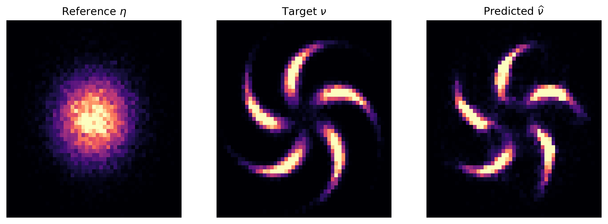
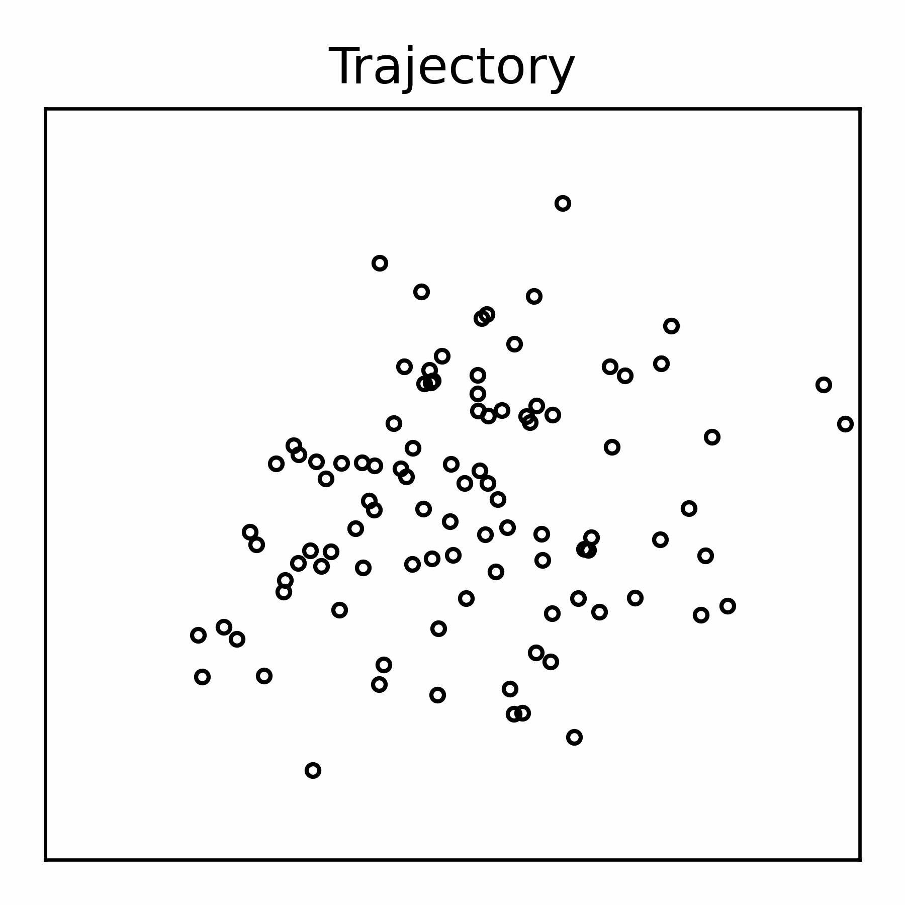

# Kernel Ordinary Differential Equations (KODE) 

This code generates the experiments in the paper. 

> Biraj Pandey*, Bamdad Hosseini, Pau Battle, and Houman Owhadi. 
> "Diffeomorphic Measure Matching with Kernels for Generative Modeling".
> [[arxiv]](https://arxiv.org/pdf/2402.08077.pdf)


## Setup:

1. Do a clean download of the repository.
   ```
   git clone https://github.com/birajpandey/KernelODETransport.git
   ```
2. Go to the downloaded repo
   ```
   cd path/to/KernelODETransport
   ```
3. Run the `Makefile`. It creates an anaconda environment called `kode_env`, 
   downloads  required  packages, datasets and runs tests.

   ```
   make 
   ```
3. Activate the conda environment. 

   ```
   conda activate kode_env
   ```

4. Install the `kode` package
   ```
   pip install -e .
   ```
   
5. Run the files in `scripts/` to reproduce our published results. 

__Remark__: This project structure is based on the 
<a target="_blank" href="https://drivendata.github.io/cookiecutter-data-science/">
cookiecutter data science project template</a>. I also took a great deal of 
help from the <a target="_blank" href="https://goodresearch.dev/#alternative-formats">
The Good Research Code Handbook</a> written by Patrick J Mineault. 

## Example:
Here we fit the KODE model to sample from the pinwheel distribution.
```python
import numpy as np
import jax.random as jrandom
import matplotlib.pyplot as plt

from kode.data import load_dataset
from kode.models import transporter, kernels, losses, utils
from kode.visualization import visualize

# generate data
Y = load_dataset.two_dimensional_data('pinwheel', batch_size=5000, rng=None)
X = np.random.normal(size=(5000, 2))

# find inducing points
num_inducing_points = 100
inducing_points, median_distance = utils.find_inducing_points(X, Y,  
                                                              num_inducing_points, 
                                                              random_state=20)

# define model params 
model_params = {'length_scale': [0.1 * median_distance]}
num_discrete_steps, num_solver_steps = 5, 10
model_kernel = kernels.get_kernel('rbf', model_params)

# define loss function and parameters
loss_params = {'length_scale': [0.15 * median_distance]}
loss_kernel = kernels.get_kernel('laplace', loss_params)
mmd_loss_fun = losses.MMDLoss(loss_kernel)

# initialize the optimizer
optimizer = utils.get_adam_with_exp_decay()

# initialize the model
key = jrandom.PRNGKey(20)
transport_model = transporter.Transporter(inducing_points, model_kernel,
                                        num_discrete_steps, num_solver_steps, key)
gradient_mask = transport_model.get_gradient_mask()

# train
num_epochs = 501
rkhs_strength, h1_strength = 1e-6, 1e-6
batch_size = 5000
transport_model.fit(X, Y,  num_epochs, mmd_loss_fun, rkhs_strength,
                h1_strength, batch_size, optimizer)

# transform using the model
Y_pred, Y_traj = transport_model.transform(X, num_steps=20,  trajectory=True)


# Plot results
fig = plt.figure(figsize=(12, 4))
ax1, ax2, ax3 = visualize.plot_2d_distributions(fig, X, Y, Y_pred)
plt.show()
``` 


<p align="center">

</p>


## Reproducing experiments

Different scripts are provided for different datasets. To see all options, 
use the `-h` flag.

#### Hyperparameters
To see the hyperparameters used in each experiment, use the 
`load_hyperparameters.py` function.
```python
from kode.models import load_hyperparameters
parameters = load_hyperparameters.two_dimensional_data('pinwheel')
```

#### 2d benchmarks
To reproduce our experiments for 2d benchmarks, run:
```
python scripts/train_2d_benchmarks.py --dataset pinwheel --save-name pinwheel_experiment
```

You can change the model parameters via the command line.
```
python scripts/train_2d_benchmarks.py --dataset pinwheel --num-inducing-points 500 --num-epochs 101 --save-name modified_pinwheel_experiment
```

To evaluate the trained model, run:
```
python scripts/evaluate_2d_benchmarks.py --dataset pinwheel --file-name pinwheel_experiment
```

#### High dimensional benchmarks:
To reproduce our results on high dimensional benchmarks, run:
```
python scripts/train_high_dimensional_benchmarks.py --dataset power --save-name power_experiment
```

#### Conditional 2d experiments:
To reproduce our results on 2d conditioning experiments, run:
```
python scripts/train_conditional_2d_benchmarks.py --dataset pinwheel --save-name conditional_pinwheel_experiment
```

#### Lotka-Volterra experiment:
To reproduce our results on lotka volterra experiment, run:
```
python scripts/train_lotka_volterra.py --save-name lv_experiment
```

## Acknowledgements
This material is in part based upon work supported by the US National 
Science Foundation Grant DMS-208535, NSF Graduate Fellowship grant 
DGE-1762114, and US AOFSR Grant FA9550-20-1-0358. Any opinions, findings, 
and conclusions or recommendations expressed in this material are those of 
the author(s) and do not necessarily reflect the views of the funding agencies.


